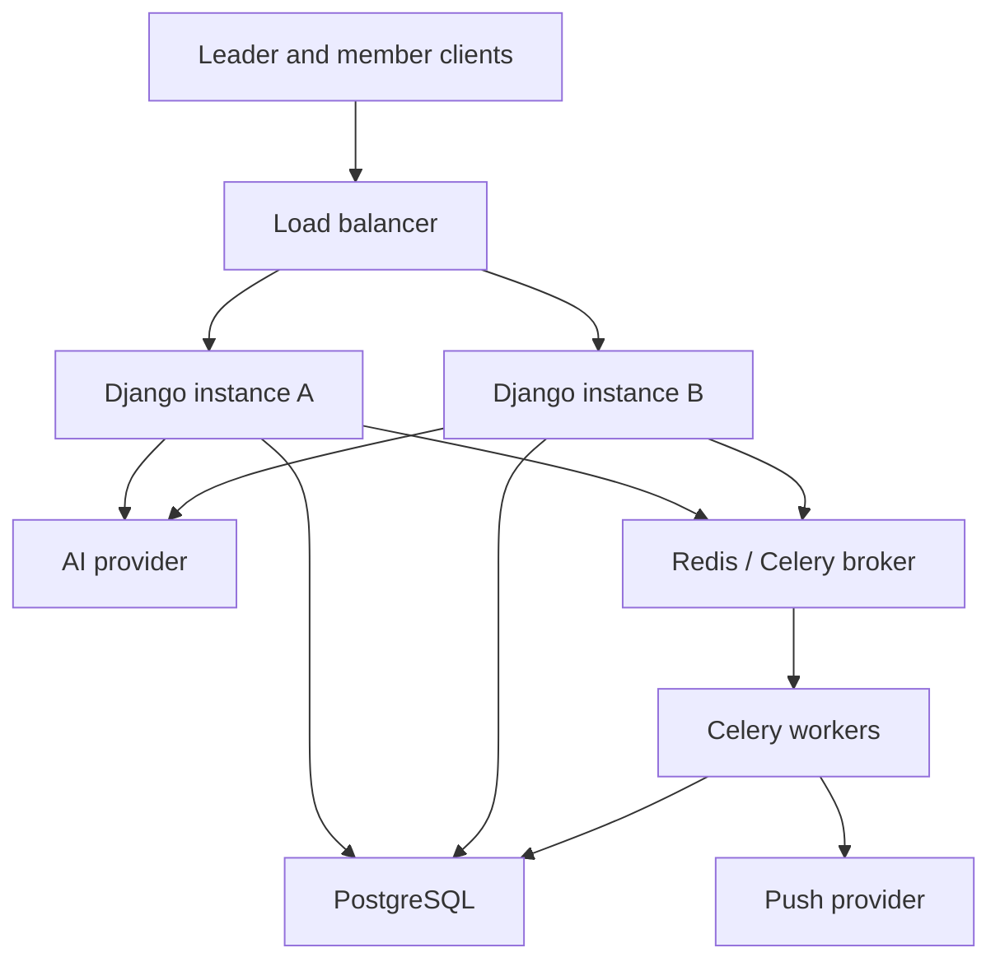

# Part 0 - Requirements

## What I am going to build

I will build a secure Member Callout application where a local union leader can create an announcement, optionally use AI to draft its wording, review and approve it, and send it to all members or a selected classification within their local. Members can view announcements, mark them as read, acknowledge them, and optionally respond to attendance requests, while leaders can view delivery and engagement statistics.

## Assumptions

The application is for union leaders and members, and each person belongs to exactly one local; a leader is also a member of that local. “Immediately” means delivery begins when the leader sends the approved announcement, but completion may take time for a large local. The creator can approve their own announcement, attendance confirmation is optional and only applies to relevant announcements, and the work is complete when the required creation, approval, delivery, member-response, statistics, duplicate-prevention, and local-isolation flows function correctly.

## Concerns

The strongest concern is privacy: information belonging to one local must never be exposed to another local, so every API operation must be scoped using the authenticated member’s local rather than a client-provided local ID. AI generation must receive only the rough announcement text—not member identities or contact information—and push delivery statistics must not imply guaranteed receipt because some notifications may fail silently.

## Questions for Denise

1. Does “immediately” mean the API must wait for every notification to finish, or may delivery continue after the request returns? I assumed delivery should begin immediately while completion may occur afterward.
2. Is attendance confirmation required for every announcement or only event-related announcements? I assumed it is optional and enabled only when needed.
3. Should a second leader approve an announcement, or can its creator review and approve it? I assumed the same leader can create and approve it because a separate approver is not specified.


# Part A — Design

## 1. Data model

The design uses five tables.

### `locals`

Represents one union local and acts as the tenant boundary.

Important fields: `id`, `name`, and `created_at`.

### `members`

Represents both a union member and their login account. Important fields are `id`, `local_id`, `full_name`, `email`, `classification`, `role`, `status`, `password`, and `is_active`.

A member belongs to exactly one local. `role` is either `member` or `leader`; therefore, a separate users or local-access table is unnecessary for the stated requirements.

### `announcements`

Stores the announcement and its lifecycle. Important fields are `id`, `local_id`, `created_by_id`, `title`, `body`, `push_preview`, `target_classification`, `needs_ack`, `needs_rsvp`, `event_at`, `generated_by_ai`, `status`, `approved_at`, `queued_at`, and `sent_at`.

The lifecycle is:

```text
draft → approved → queued → sent
```

The creator reviews and approves their own announcement. Editing an approved announcement returns it to `draft` and clears `approved_at`, ensuring changed content is reviewed again.

A null `target_classification` means all eligible members in the local. Otherwise, only members with the selected classification are included.

### `announcement_recipients`

Records exactly who an announcement went to and what that member did with it. Important fields are `id`, `local_id`, `announcement_id`, `member_id`, `classification_snapshot`, `delivery_status`, `sent_at`, `read_at`, `acknowledged_at`, `rsvp`, and `rsvp_at`.

Each member’s state is represented as follows:

* Nothing: `read_at`, `acknowledged_at`, and `rsvp` are null.
* Read: `read_at` contains a timestamp.
* Acknowledged: `acknowledged_at` contains a timestamp; acknowledgement also marks the announcement as read.
* Coming: `rsvp = 'coming'`.
* Cannot come: `rsvp = 'cant_come'`.

`delivery_status` is limited to `pending`, `sent`, or `failed`. `UNIQUE (announcement_id, member_id)` prevents duplicate recipient records.

### `announcement_stats`

Stores one summary row per announcement. It contains `target_count`, `sent_count`, `failed_count`, `read_count`, `acknowledged_count`, `coming_count`, `cant_come_count`, and `updated_at`.

The recipient table remains the detailed source of truth, while this table provides fast dashboard reads. I rejected storing only aggregate statistics because that would make it impossible to determine which individual member read, acknowledged, or responded.

## 2. The send path

At 14:02, leadership presses Send.

1. The request reaches the load balancer and is routed to a Django instance.
2. Django authenticates the member and verifies that they are an active leader, created the announcement, and belong to the announcement’s local.
3. The application performs an atomic conditional update from `approved` to `queued`. If another request already changed the status, the update affects zero rows and no second send operation starts.
4. An `announcement_stats` row is created and the target audience count is calculated.
5. After the database transaction commits, Django submits a Celery task containing the announcement ID and local ID.
6. The API returns `202 Accepted` with the announcement ID and `queued` status. It does not wait for 22,400 notifications to finish.

The remaining work happens in Celery:

7. A worker loads the queued announcement and selects active members from the same local, applying `target_classification` when present.
8. It creates recipient records using bulk inserts and `ON CONFLICT DO NOTHING`. Recipients are processed in manageable batches rather than through 22,400 individual Django inserts.
9. Delivery workers attempt notifications for recipients whose status is `pending`.
10. Each attempted recipient becomes `sent` or `failed`, and the statistics row is updated once per batch.
11. When `sent_count + failed_count = target_count`, the announcement becomes `sent`.

A `sent` result means the notification provider accepted the attempt; it does not prove the member saw it. `read_at` is the stronger engagement signal.

The status screen reads one indexed `announcement_stats` row instead of repeatedly counting recipient records. Four people polling once per second therefore produce small primary-key lookups rather than four scans over 22,400 rows. Responses can additionally use `updated_at` as an ETag or short shared-cache key.

I rejected performing all notification calls inside the initial HTTP request because provider latency and large audiences would make the endpoint slow and vulnerable to timeouts.

## 3. Rule 1 and Rule 2

### Rule 1: one local’s information must never reach another local

Every tenant-owned table contains `local_id`. The authenticated member’s local is established by middleware and stored in request context. Tenant-aware model managers automatically apply that local to normal ORM queries and reject access when no local context exists.

Views do not accept `local_id` as authority from request data. Leadership actions are implemented in service functions that check the member’s role, local, and announcement ownership. Cross-local resources return `404`, avoiding confirmation that another local’s record exists.

Composite foreign keys provide database-level relationship protection:

* A recipient’s `(local_id, announcement_id)` must match its announcement.
* The same recipient’s `(local_id, member_id)` must match its member.
* An announcement’s creator must be a member of the same local.

This prevents an announcement from being connected to a member or leader from another local. New endpoints are required to use the tenant-aware manager and shared permission classes; automated tests attempt cross-local list, retrieve, update, send, read, acknowledge, RSVP, and statistics requests. PostgreSQL Row-Level Security is a later defence-in-depth enhancement.

In production, every request log includes the authenticated member ID, authenticated local ID, resource local ID, endpoint, and response status. Any tenant mismatch, unexpected unscoped query, or cross-local authorization failure is reported as a security alert. A scheduled integrity query also checks for cross-local recipient relationships, although the composite foreign keys should make them impossible.

### Rule 2: the same member must not receive the same announcement twice

The send endpoint uses an atomic `approved → queued` update. Retrying the HTTP request cannot queue the announcement again because it is no longer `approved`.

Audience creation is repeatable because `announcement_recipients` has:

```sql
UNIQUE (announcement_id, member_id)
```

Workers insert with `ON CONFLICT DO NOTHING`. If audience expansion restarts halfway through, existing recipients are ignored and only missing recipients are created.

Delivery workers process only `pending` recipients and skip rows already marked `sent`. Each provider request uses a deterministic idempotency key derived from the announcement and member IDs. This closes the crash window where a provider accepts a notification but the worker stops before recording `sent`. If the chosen provider does not support idempotency, true exactly-once external delivery is impossible and the system must document at-least-once delivery instead.

Production monitoring records one delivery result per recipient and provider idempotency key. Alerts are raised for duplicate provider keys, duplicate-delivery responses, cross-local mismatches, statistics exceeding `target_count`, or differences between recipient records and aggregate statistics.

## 4. Diagram


